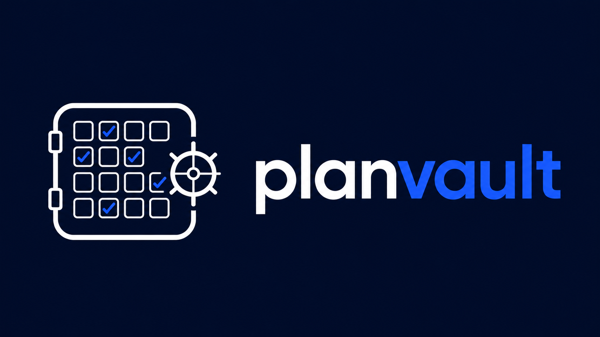

<p align="center">
  
</p>
**planvault** is a provider-neutral Agent Skill for creating, maintaining and executing technical implementation plans without losing requirements, decisions or execution state across long agentic sessions.

The problem is not usually the first prompt. It is what happens after 20 or 30 exchanges.

You start with a clear plan, several phases and a set of constraints. Later, the agent reopens a decision that was already settled, forgets an earlier requirement, changes something that was already agreed on, or skips part of the plan while the conversation keeps growing.

`planvault` makes the plan persistent and verifiable instead of leaving it implicit in the conversation context.

> Once a decision is confirmed, it should remain stable unless new evidence or an explicit user request changes it.

---

## What planvault solves

| Problem | planvault approach |
|---|---|
| Requirements are treated as loose prose | Every implementation requirement gets a stable REQ-ID |
| Requirements are silently skipped | Completion is tracked directly in the plan |
| Early decisions disappear from context | Stable decisions are persisted incrementally |
| Closed questions are reopened during execution | Confirmed decisions form a trust boundary |
| Large plans become difficult to navigate | Triage decides whether the plan stays single-file or is split |
| Repeated review rules drift between phases | Shared review criteria can be extracted into a generated template |
| Updates overwrite previous decisions | Conflicts are surfaced before the plan is changed |
| A phase is marked done without proof | Completed requirements carry implementation evidence |

---

## How it works

`planvault` is a **single Agent Skill**.

The entry point is:

```text
skill/planvault/SKILL.md
```

The `SKILL.md` file contains the lifecycle routing rules and loads focused reference files only when they are needed.

```text
planvault
│
├── SKILL.md
│   └── lifecycle routing + global invariants
│
├── agents/
│   └── openai.yaml
│       └── optional OpenAI-specific UI/invocation metadata
│
└── references/
    ├── plan-draft.md
    ├── plan-triage.md
    ├── plan-update.md
    └── plan-execute.md
```

The files in `references/` are **not separate skills** and are not invoked directly by the user.

They are workflow modules read by `planvault` as the plan moves through its lifecycle.

---

## Lifecycle

```text
Reason about the change
        ↓
Draft the plan
        ↓
Triage its structure
        ↓
Update when requirements change
        ↓
Execute REQ-IDs
        ↓
Verify completion
```

### Draft

The draft workflow turns stable decisions into a persistent plan.

Requirements are written as atomic entries:

```markdown
- [ ] REQ-2.1.1 `src/service/foo.ts`: add validation for expired tokens
- [ ] REQ-2.1.2 `src/service/foo.ts`: map validation failures to the existing error type
```

A requirement should describe one logical change with one observable outcome.

The plan is updated incrementally as decisions stabilize instead of being reconstructed from a long conversation at the end.

---

### Triage

Triage decides how the plan should be stored before execution.

A plan can stay in a single file when it is reasonably small and cohesive.

For larger plans, `planvault` can split the plan into three core files:

```text
spec.md
plan.md
tasks.md
```

Their responsibilities are intentionally separate:

```text
spec.md
└── objective, constraints, confirmed decisions, out-of-scope, exit criteria

plan.md
└── implementation approach, phases, dependencies, execution order

tasks.md
└── REQ-ID checklist and completion evidence
```

Optional generated support files, such as `review-audit-template.md`, can live alongside those three core plan files.

They do not change the fact that the plan itself uses the three-file structure.

---

### Update

When the user changes an existing plan, `planvault` identifies the affected REQ-IDs and applies the smallest necessary change.

Existing requirements keep their IDs.

If a completed requirement changes materially, it is reopened:

```markdown
- [ ] REQ-2.1.3 `src/auth/token.ts`: rotate the refresh token after use — reopened
```

Removed requirements keep their identifier for historical traceability instead of causing later IDs to shift.

If a requested change conflicts with an already confirmed constraint or decision, `planvault` surfaces the conflict instead of silently replacing the existing plan.

If the update materially changes the size or structure of the plan, triage must be run again before execution continues.

---

### Execute

Execution works from the plan instead of reconstructing requirements from the conversation.

`planvault` executes one phase at a time unless the user explicitly requests a broader scope.

For each REQ-ID it:

1. reads the requirement;
2. inspects the current implementation context needed to perform the change;
3. implements the requirement;
4. verifies the result;
5. updates the requirement status while preserving its original description.

Example:

```markdown
- [x] REQ-2.1.1 `src/service/foo.ts`: add validation for expired tokens
  - Evidence: `src/service/foo.ts:42-58`
```

The evidence is appended to the requirement. The original requirement text is never replaced by the status update.

---

## Trust boundary

`planvault` separates **confirmed decisions** from **implementation evidence**.

When the plan is marked:

```text
ANALYSIS: COMPLETE
```

confirmed architectural decisions, constraints and conclusions should not be reopened without a reason.

This does **not** mean the agent is forbidden from reading the current source code.

During execution the agent may still inspect files, tests, diffs and other current implementation state when that is necessary to implement or verify a REQ-ID.

The rule is:

> Do not reopen a confirmed decision unless new evidence creates a real conflict. Reading current code to execute the decision is allowed and expected.

If new evidence contradicts the plan, execution stops and the plan returns to update/analysis instead of silently choosing a new direction.

---

## REQ-ID format

The canonical format is:

```text
REQ-{phase}.{section}.{n}
```

Example:

```text
REQ-2.1.3
```

IDs remain stable for the lifetime of the plan.

If a phase needs to be subdivided, keep the numeric REQ-ID namespace stable and represent the sub-phase in headings rather than changing the identifier grammar.

Example:

```markdown
## Phase 2 — Authentication

### Phase 2A — Refresh token validation

- [ ] REQ-2.1.1 ...
- [ ] REQ-2.1.2 ...

### Phase 2B — Rotation

- [ ] REQ-2.2.1 ...
- [ ] REQ-2.2.2 ...
```

---

## Analysis state

A plan uses an explicit analysis state:

```text
ANALYSIS: IN_PROGRESS
```

or:

```text
ANALYSIS: COMPLETE
```

`IN_PROGRESS` means decisions are still being investigated or changed.

`COMPLETE` means the plan contains enough confirmed information to execute without reopening its architectural reasoning.

A plan must not be executed while analysis is incomplete.

If execution discovers evidence that invalidates a confirmed assumption, the plan returns to `IN_PROGRESS` and is updated before execution continues.

---

## Phase completion

A phase is complete only when every active REQ-ID in that phase is complete and has implementation evidence.

Example:

```markdown
- [x] REQ-2.1.1 `src/service/foo.ts`: add token expiration validation
  - Evidence: `src/service/foo.ts:42-58`

- [x] REQ-2.1.2 `src/service/foo.ts`: return the existing authentication error
  - Evidence: `src/service/foo.ts:61-68`

- [x] REQ-2.2.1 `tests/foo.test.ts`: cover expired-token behavior
  - Evidence: `tests/foo.test.ts:31-54`
```

A phase is not complete when:

- an active REQ-ID is still `[ ]`;
- implementation evidence is missing;
- required verification failed;
- a conflict has reopened the plan;
- analysis is no longer `COMPLETE`.

---

## Review audit template

When the same review procedure is repeated across multiple phases, triage can generate:

```text
review-audit-template.md
```

alongside the plan.

The template can contain shared checks such as:

- all REQ-IDs in the phase were implemented;
- no requirement was silently omitted;
- targeted tests pass;
- no confirmed regression was introduced;
- no redundant or unused code was added.

A phase uses the generated template only when the plan explicitly references it.

The template is a generated plan artifact, not part of the reusable Agent Skill.

---

## Installation

`planvault` follows the open Agent Skills format: a skill directory containing a `SKILL.md` file plus optional references, scripts, assets and host-specific metadata.

### OpenAI Codex

Codex discovers repository-scoped skills under:

```text
.agents/skills/
```

and personal skills under:

```text
~/.agents/skills/
```

#### Project scope

Copy the skill directory into the repository:

```bash
mkdir -p .agents/skills
cp -R /path/to/planvault/skill/planvault .agents/skills/planvault
```

The resulting structure must be:

```text
<repository>/
└── .agents/
    └── skills/
        └── planvault/
            ├── SKILL.md
            ├── agents/
            │   └── openai.yaml
            └── references/
```

#### User scope

To make the skill available across repositories:

```bash
mkdir -p ~/.agents/skills
cp -R /path/to/planvault/skill/planvault ~/.agents/skills/planvault
```

Codex can also install skills from other repositories through its built-in skill installer.

Invoke:

```text
$skill-installer
```

and provide this repository plus the skill path:

```text
skill/planvault
```

For reusable public distribution, OpenAI recommends packaging skills as a plugin rather than relying only on manual local installation.

#### Invocation

Codex can invoke the skill implicitly when the prompt matches its description.

For explicit invocation, mention the skill with:

```text
$planvault
```

You can also inspect installed skills with:

```text
/skills
```

Examples:

```text
$planvault create an implementation plan for refresh-token rotation
```

```text
$planvault update the existing plan to use Redis instead of the in-memory store
```

```text
$planvault execute phase 2
```

---

### Claude Code

Claude Code discovers personal skills under:

```text
~/.claude/skills/
```

and project skills under:

```text
.claude/skills/
```

#### Project scope

```bash
mkdir -p .claude/skills
cp -R /path/to/planvault/skill/planvault .claude/skills/planvault
```

Result:

```text
<repository>/
└── .claude/
    └── skills/
        └── planvault/
            ├── SKILL.md
            ├── agents/
            │   └── openai.yaml
            └── references/
```

`agents/openai.yaml` is ignored by hosts that do not use OpenAI-specific metadata and does not prevent the skill from remaining portable.

#### Personal scope

```bash
mkdir -p ~/.claude/skills
cp -R /path/to/planvault/skill/planvault ~/.claude/skills/planvault
```

#### Invocation

Claude can load the skill automatically when the request matches its description.

It can also be invoked directly with:

```text
/planvault
```

Examples:

```text
/planvault create an implementation plan for refresh-token rotation
```

```text
/planvault update the existing plan
```

```text
/planvault execute phase 2
```

Use:

```text
/skills
```

to inspect and manage the skills visible to the current Claude Code session.

---

## Other Agent Skills-compatible hosts

The core of `planvault` is intentionally host-neutral:

```text
SKILL.md
references/
```

`agents/openai.yaml` only adds optional OpenAI-specific metadata.

Any host implementing the Agent Skills specification can use the core skill as long as it supports loading `SKILL.md` and referenced files.

Host-specific installation paths and invocation syntax may differ.

---

## Repository structure

```text
planvault/
├── LICENSE
├── README.md
└── skill/
    └── planvault/
        ├── SKILL.md
        ├── agents/
        │   └── openai.yaml
        └── references/
            ├── plan-draft.md
            ├── plan-triage.md
            ├── plan-update.md
            └── plan-execute.md
```

### `SKILL.md`

Defines:

- skill metadata;
- when the skill should trigger;
- lifecycle detection;
- global invariants;
- which reference workflow should be read next.

### `references/plan-draft.md`

Defines:

- plan format;
- REQ-ID creation;
- incremental checkpoints;
- analysis state.

### `references/plan-triage.md`

Defines:

- single-file vs three-core-file decision;
- phase density rules;
- shared review-pattern detection;
- optional `review-audit-template.md` generation.

### `references/plan-update.md`

Defines:

- minimum-diff plan updates;
- conflict detection;
- REQ-ID continuity;
- reopening completed requirements;
- when structural triage must be repeated.

### `references/plan-execute.md`

Defines:

- execution preconditions;
- trust-boundary behavior;
- REQ-ID execution;
- implementation evidence;
- phase completion;
- conditional review.

---

## Design principles

### One skill, one lifecycle

Drafting, triage, updates and execution are not exposed as separate skills.

They are stages of the same planning workflow.

The user interacts with one skill:

```text
planvault
```

and the skill chooses the appropriate internal reference workflow.

### Progressive disclosure

The full workflow does not need to stay permanently in context.

The host first sees the skill name and description.

When `planvault` is selected, it reads `SKILL.md`.

The router then reads only the reference material required for the current lifecycle stage.

### Stable IDs

REQ-IDs are persistent identifiers.

They are not renumbered after updates because later execution notes, discussions and evidence may already refer to them.

### Decisions are stable, code is inspectable

Confirmed reasoning should not be repeatedly reopened.

Current source code is still inspected whenever implementation or verification requires it.

### Conflicts are explicit

A new instruction that contradicts a confirmed plan decision does not silently replace it.

The conflict becomes part of the plan lifecycle and must be resolved before execution continues.

---

## Example

```markdown
# Plan: Refresh token rotation

ANALYSIS: COMPLETE

## 1. Objective

Rotate refresh tokens after every successful use while preserving the existing authentication contract.

## 2. Context and constraints

- Keep the existing JWT access-token format.
- Reuse the current authentication error model.
- Do not introduce a second persistence layer.

## 3. Phase 1 — Token validation

- [x] REQ-1.1.1 `src/auth/token.ts`: reject expired refresh tokens
  - Evidence: `src/auth/token.ts:44-57`

- [x] REQ-1.1.2 `tests/auth/token.test.ts`: cover expired refresh tokens
  - Evidence: `tests/auth/token.test.ts:71-96`

## 4. Phase 2 — Rotation

- [ ] REQ-2.1.1 `src/auth/token.ts`: invalidate the consumed refresh token
- [ ] REQ-2.1.2 `src/auth/token.ts`: issue a replacement refresh token
- [ ] REQ-2.1.3 `tests/auth/token.test.ts`: verify one-time refresh-token usage
```

The plan remains the source of truth throughout execution.

---

## License

MIT — see [LICENSE](LICENSE).
